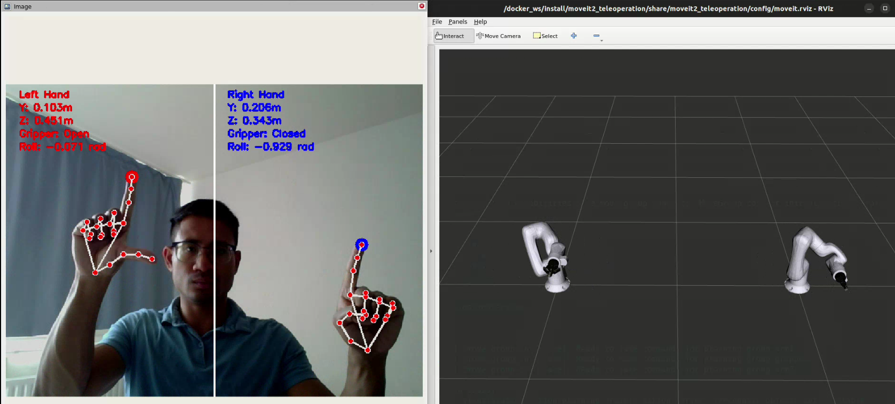
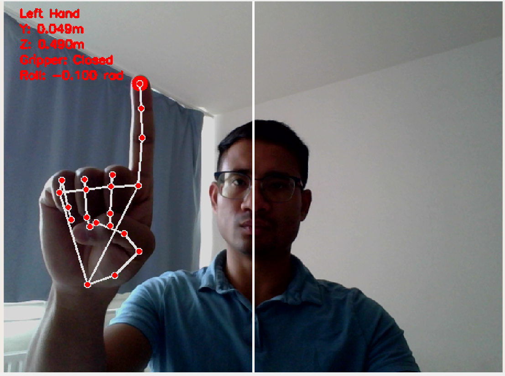
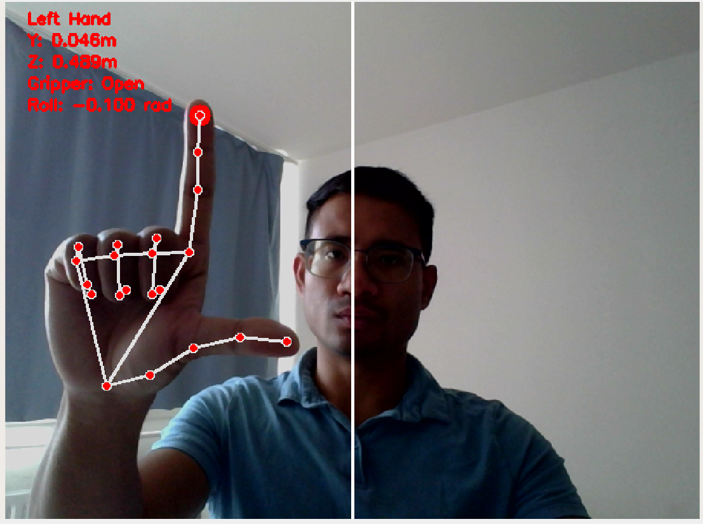
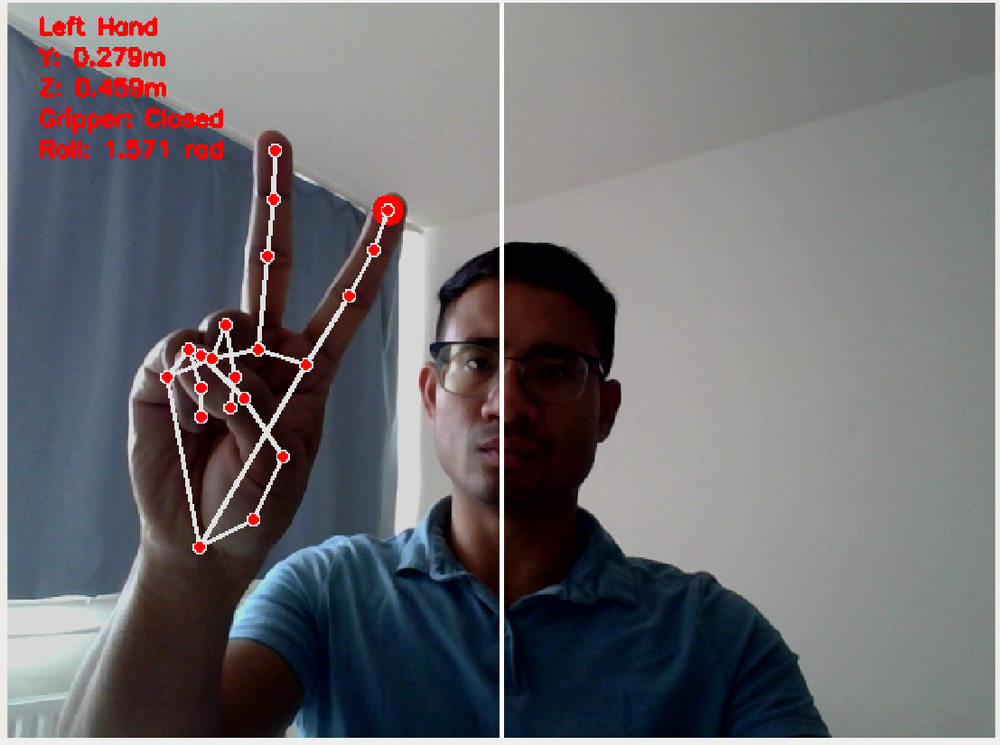
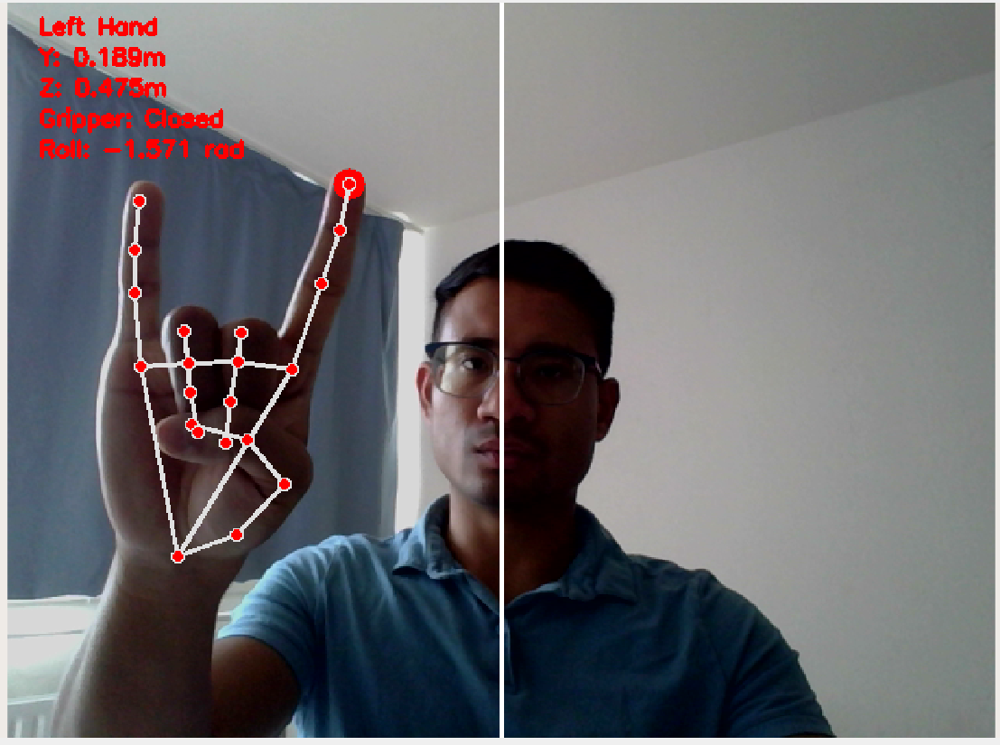

# Teleoperation Challenge Solution

This README provides instructions to run the solution.

## Overview

The solution is implemented using **ROS 2 Humble** and consists of following ROS 2 packages:
- `gesture_to_pose`
- `moveit2_teleoperation`
- `kuka_lbr_iisy_support`
- `kuka_resources`

### `gesture_to_pose` Package

This package includes the node:

- **Gesture_To_Pose**

  Converts hand gestures detected using `Mediapipe` into pose messages to control the robots. Following topics publish the information

    - `/web_cam_image` - to view the webcam image in RVIZ2 
    - `/robot1/target_pose` - the pose message for robot 1
    - `/robot2/target_pose` - the pose message for robot 2
    - `/robot1/gripper_command` - the boolean signal to open or close the gripper for robot 1
    - `/robot2/gripper_command` - the boolean signal to open or close the gripper for robot 2
  
### `moveit2_teleoperation` Package

This package includes the following nodes:

- **Teleoperator**

  - Starts 4 move group interfaces to control the two robots and their grippers. 
  - Subscribes to the different topics and then plans and executes the  trajectory.

- **Joint_Angle_Publisher**

  Publishes the joint angle values of the robots and grippers as `JointState` type message on the topics -

  - `/robot1_joint_angles`
  - `/robot2_joint_angles`

The moveit planning related configs are inside the `config` folder.

### `kuka_lbr_iisy_support` Package

This package contains the robot and gripper description files.

### `kuka_resources` Package

A dependency package for `kuka_lbr_iisy_support`.


## Running the Solution

Follow these steps to run the solution:

### 1. Build the Docker container
Build using VSCode Dev Container, or using docker build.

### 2. Build the ROS 2 Workspace
```bash
colcon build 
``` 

### 3. Source the workspace
```bash
source install/setup.bash 
``` 

### 4. Start using launcher

Launch the dummy bin picking cell, using:
```bash
ros2 launch moveit2_teleoperation launch_teleoperation_sim.launch.py
```
### 5. Control the robot using gestures

  1. `Y-Z motion` - Tracks the tip of the index finger

      

  2. `Close Gripper` - Tracks if thumb is retracted 

      

  3. `Open Gripper` - Tracks if thumb is extended 

      

  4. `Increase Roll angle` - Tracks if middle finger is extended then increases the roll value

      

  5. `Decrease Roll angle` - Tracks if little finger is extended, then decrease the roll value 

      

            

## Task Completion Overview


- [x] **Task 1** - Environment Setup - ROS2 Humble + Docker
- [x] **Task 2** - Robot Arm Visualisation 
- [x] **Task 3** - Message Publishing - joint_angle_publisher node
- [x] **Task 4** - Teleoperation node
  - [x] **Version Control** - Added
  - [x] **Video Demonstration** - demo.webm
  - [x] **References** - Added below
- [x] **Handle Noise** - pose y,z values averaged over last 5 values
- [x] **One operator**

### 8. References
- [ROS 2 Offical documentation](https://docs.ros.org/en/humble/Tutorials.html)
- [Mediapipe](https://ai.google.dev/edge/mediapipe/solutions/vision/hand_landmarker)
- [OpenCV](https://docs.opencv.org/4.x/d9/df8/tutorial_root.html)
- [Moveit2](https://moveit.picknik.ai/humble/index.html)
- [Kuka Description](https://github.com/kroshu/kuka_robot_descriptions)
- [Dual Arm Setup](https://github.com/moveit/moveit_resources/tree/ros2/dual_arm_panda_moveit_config)
- [NumPy](https://numpy.org/doc/stable/)